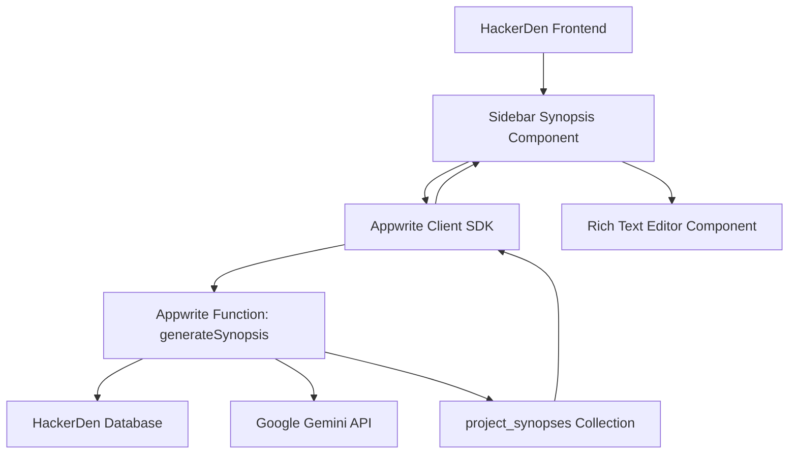

# Design Document: AI-Powered Project Synopsis Generator

## Overview

The AI-Powered Project Synopsis Generator is a sidebar-integrated feature within HackerDen that leverages existing project data to automatically generate comprehensive, presentation-ready project summaries. The system uses a secure backend architecture with Appwrite serverless functions to interact with AI services (Google Gemini API) while maintaining data privacy and API key security.

The feature follows a data-driven approach, collecting information from the existing HackerDen database (hackathons, teams, tasks) and using sophisticated prompt engineering to generate structured, professional summaries that teams can edit and finalize.

## Architecture

### High-Level Architecture



### Component Architecture

1. **Frontend Layer**
   - Sidebar Synopsis Panel: Integrated into HackerDen's existing sidebar
   - Rich Text Editor: For editing generated content
   - Loading States & Error Handling: User feedback components

2. **Backend Layer**
   - Appwrite Serverless Function: Secure AI API interaction
   - Database Collections: Data storage and retrieval
   - Environment Configuration: Secure API key management

3. **External Services**
   - Google Gemini API: AI text generation service
   - Existing HackerDen Collections: Data source for synopsis generation

## Components and Interfaces

### Frontend Components

#### 1. SynopsisPanel Component
```typescript
interface SynopsisPanel {
  teamId: string;
  hackathonId: string;
  onGenerate: () => Promise<void>;
  onSave: (content: string) => Promise<void>;
  onFinalize: () => Promise<void>;
}
```

**Responsibilities:**
- Display generation button and loading states
- Show existing synopses with version history
- Handle user interactions (generate, save, finalize)
- Manage error states and retry functionality

#### 2. SynopsisEditor Component
```typescript
interface SynopsisEditor {
  content: string;
  isEditable: boolean;
  onChange: (content: string) => void;
  onSave: () => void;
  autoSave?: boolean;
}
```

**Responsibilities:**
- Rich text editing capabilities
- Auto-save functionality
- Content validation and formatting
- Export/copy functionality for presentations

#### 3. SynopsisHistory Component
```typescript
interface SynopsisHistory {
  synopses: Synopsis[];
  currentVersion: string;
  onVersionSelect: (versionId: string) => void;
  onRegenerate: () => void;
}
```

**Responsibilities:**
- Display version history
- Allow switching between draft and final versions
- Provide regeneration options
- Show timestamps and status indicators

### Backend Components

#### 1. Appwrite Function: generateSynopsis
```typescript
interface GenerateSynopsisRequest {
  teamId: string;
  hackathonId: string;
  regenerate?: boolean;
}

interface GenerateSynopsisResponse {
  synopsisId: string;
  content: string;
  status: 'draft' | 'error';
  generatedAt: string;
  usageCount: number;
  remainingGenerations: number;
}
```

**Responsibilities:**
- Data aggregation from existing collections
- Prompt construction and AI API interaction
- Rate limiting and usage tracking
- Error handling and fallback responses
- Result storage and response formatting

#### 2. Data Aggregation Service
```typescript
interface ProjectData {
  hackathon: {
    name: string;
    theme: string;
    description?: string;
  };
  team: {
    name: string;
    members: number;
  };
  completedTasks: Task[];
  inProgressTasks: Task[];
  techStack?: string[];
}
```

**Responsibilities:**
- Query existing HackerDen collections
- Filter and format data for AI consumption
- Handle missing or incomplete data scenarios
- Validate data quality before AI processing

## Data Models

### New Collection: project_synopses

```typescript
interface ProjectSynopsis {
  $id: string;
  teamId: string;           // Relationship to teams collection
  hackathonId: string;      // Relationship to hackathons collection
  draft: string;            // AI-generated content
  final?: string;           // User-edited final version
  status: 'draft' | 'finalized';
  version: number;          // Version tracking for regenerations
  generatedAt: string;      // ISO timestamp
  finalizedAt?: string;     // ISO timestamp when finalized
  generatedBy: string;      // User ID who triggered generation
  metadata: {
    aiModel: string;        // e.g., "gemini-1.5-pro"
    promptVersion: string;  // For tracking prompt iterations
    dataSnapshot: {         // Snapshot of data used for generation
      taskCount: number;
      completedTaskCount: number;
      techStackItems: number;
    };
  };
}
```

### Usage Tracking Collection: synopsis_usage

```typescript
interface SynopsisUsage {
  $id: string;
  teamId: string;
  hackathonId: string;
  generationsToday: number;
  lastGeneration: string;   // ISO timestamp
  totalGenerations: number;
  resetDate: string;        // Daily reset timestamp
}
```

### Enhanced Task Model (if needed)
```typescript
interface Task {
  // Existing fields...
  category?: string;        // For better AI categorization
  priority?: 'low' | 'medium' | 'high';
  estimatedHours?: number;
  actualHours?: number;
}
```

## AI Integration Design

### Prompt Engineering Strategy

The system uses a structured prompt template that ensures consistent, high-quality outputs:

```typescript
interface PromptTemplate {
  systemPrompt: string;
  userPrompt: string;
  outputFormat: {
    sections: string[];
    tone: string;
    length: string;
  };
}
```

**Prompt Structure:**
1. **System Context**: Defines the AI's role as a tech journalist
2. **Output Format**: Specifies the required sections and structure
3. **Data Context**: Provides the collected project data
4. **Style Guidelines**: Ensures professional, engaging tone
5. **Constraints**: Word limits and formatting requirements

### AI Service Integration

```typescript
interface AIService {
  generateSynopsis(projectData: ProjectData, prompt: PromptTemplate): Promise<string>;
  validateResponse(response: string): boolean;
  handleRateLimit(): Promise<void>;
  estimateTokens(input: string): number;
}
```

**Implementation Details:**
- **Primary Service**: Google Gemini API (gemini-1.5-pro model)
- **Fallback Strategy**: Structured template-based generation if AI fails
- **Token Management**: Input optimization to stay within token limits
- **Response Validation**: Ensure output contains required sections

## Error Handling

### Error Categories and Responses

1. **AI Service Errors**
   - API unavailable: Fallback to template-based generation
   - Rate limit exceeded: Display wait time and retry option
   - Invalid response: Retry with modified prompt

2. **Data Errors**
   - Insufficient project data: Guide user to add more tasks
   - Missing team/hackathon info: Request manual input
   - Database connection issues: Graceful degradation

3. **User Errors**
   - Usage limit exceeded: Clear messaging about limits
   - Invalid permissions: Redirect to team leader
   - Network issues: Offline mode with cached data

### Error Recovery Strategies

```typescript
interface ErrorRecovery {
  retryWithBackoff(operation: () => Promise<any>, maxRetries: number): Promise<any>;
  fallbackGeneration(projectData: ProjectData): string;
  cacheFailedRequests(): void;
  notifyUserOfIssues(error: Error): void;
}
```

## Testing Strategy

### Unit Testing
- **Frontend Components**: React Testing Library for UI interactions
- **Backend Functions**: Jest for business logic and data processing
- **AI Integration**: Mock API responses for consistent testing
- **Data Models**: Validation and transformation testing

### Integration Testing
- **End-to-End Flows**: Cypress for complete user journeys
- **API Integration**: Test actual AI service integration
- **Database Operations**: Verify data consistency and relationships
- **Error Scenarios**: Test all error handling paths

### Performance Testing
- **AI Response Times**: Monitor and optimize generation speed
- **Database Queries**: Ensure efficient data aggregation
- **Rate Limiting**: Verify usage controls work correctly
- **Concurrent Users**: Test system under load

### User Acceptance Testing
- **Usability Testing**: Sidebar integration and workflow
- **Content Quality**: AI-generated synopsis accuracy and usefulness
- **Edge Cases**: Minimal data scenarios and error recovery
- **Accessibility**: Screen reader and keyboard navigation support

## Security Considerations

### API Key Management
- Store Gemini API key in Appwrite Function environment variables
- Implement key rotation strategy
- Monitor API usage and costs
- Restrict function execution permissions

### Data Privacy
- Only process non-sensitive project data (tasks, team names)
- Avoid including chat messages or personal information
- Implement data retention policies for generated content
- Ensure GDPR compliance for EU users

### Rate Limiting and Abuse Prevention
- Implement per-team daily generation limits
- Monitor for unusual usage patterns
- Implement CAPTCHA for suspicious activity
- Log all generation requests for audit purposes

## Performance Optimization

### Frontend Optimization
- Lazy load synopsis editor component
- Implement optimistic UI updates
- Cache generated content locally
- Minimize re-renders during editing

### Backend Optimization
- Optimize database queries with proper indexing
- Implement response caching for repeated requests
- Use connection pooling for database operations
- Implement request queuing for high load scenarios

### AI Service Optimization
- Optimize prompts to reduce token usage
- Implement response streaming for better UX
- Cache common prompt patterns
- Monitor and optimize API call frequency

## Deployment and Monitoring

### Deployment Strategy
- Deploy Appwrite function with proper environment configuration
- Update frontend with feature flag for gradual rollout
- Database migration for new collections
- Monitor deployment health and rollback procedures

### Monitoring and Analytics
- Track generation success rates and response times
- Monitor AI service costs and usage patterns
- Collect user feedback on synopsis quality
- Alert on error rates and service degradation

### Maintenance Considerations
- Regular prompt optimization based on user feedback
- AI model updates and compatibility testing
- Database cleanup for old synopsis versions
- Performance monitoring and optimization