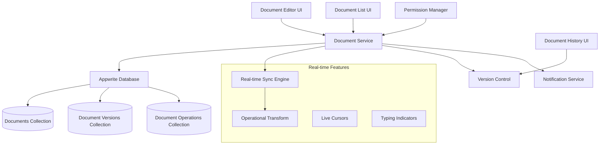

# Design Document

## Overview

The Collaborative Documents feature will integrate seamlessly with HackerDen's existing team-based architecture, providing real-time markdown document editing capabilities. The feature leverages Appwrite's real-time database and follows the established patterns for team-scoped resources, real-time synchronization, and notification integration.

The system will use operational transformation (OT) principles for conflict resolution during simultaneous editing, maintain document version history, and provide a rich markdown editing experience with live preview capabilities.

## Architecture

### High-Level Architecture



### Component Architecture

The feature follows HackerDen's established component patterns:

1. **Page Components**: DocumentsPage, DocumentEditorPage
2. **Layout Components**: DocumentsLayout, EditorLayout  
3. **Feature Components**: DocumentList, DocumentEditor, DocumentHistory
4. **UI Components**: MarkdownEditor, DocumentCard, VersionCompare
5. **Service Layer**: documentService, versionService, collaborationService

## Components and Interfaces

### Core Components

#### DocumentsPage
- Main documents dashboard showing team documents
- Integrates with existing HackathonLayout and Sidebar
- Provides document creation, search, and filtering
- Follows existing page component patterns

#### DocumentEditor
- Real-time collaborative markdown editor
- Split-pane layout: editor on left, preview on right
- Live cursor tracking and user presence indicators
- Auto-save functionality with conflict resolution

#### DocumentList
- Grid/list view of team documents
- Search and filter capabilities
- Document metadata display (author, modified date, collaborators)
- Quick actions (rename, delete, duplicate, export)

#### MarkdownEditor
- Rich text editing with markdown syntax highlighting
- Real-time collaborative editing with operational transformation
- Toolbar for common markdown operations
- Keyboard shortcuts and accessibility support

### Service Layer

#### documentService
```javascript
export const documentService = {
  // CRUD operations
  async createDocument(teamId, hackathonId, documentData),
  async getTeamDocuments(teamId, hackathonId, filters),
  async getDocument(documentId),
  async updateDocument(documentId, updates),
  async deleteDocument(documentId),
  
  // Collaboration features
  async applyOperation(documentId, operation),
  async getDocumentOperations(documentId, fromVersion),
  subscribeToDocument(documentId, callback),
  
  // Permission management
  async updatePermissions(documentId, permissions),
  async requestAccess(documentId, userId),
  
  // Export functionality
  async exportDocument(documentId, format)
}
```

#### collaborationService
```javascript
export const collaborationService = {
  // Real-time editing
  async sendOperation(documentId, operation),
  async transformOperation(operation, againstOperations),
  subscribeToOperations(documentId, callback),
  
  // User presence
  async updateCursor(documentId, userId, position),
  async setTypingStatus(documentId, userId, isTyping),
  subscribeToPresence(documentId, callback)
}
```

#### versionService
```javascript
export const versionService = {
  // Version management
  async createSnapshot(documentId, content, metadata),
  async getVersionHistory(documentId),
  async getVersionContent(versionId),
  async compareVersions(versionId1, versionId2),
  async restoreVersion(documentId, versionId)
}
```

## Data Models

### Documents Collection
```javascript
{
  $id: "unique_document_id",
  teamId: "team_id",
  hackathonId: "hackathon_id", 
  title: "Document Title",
  content: "# Markdown content...",
  contentVersion: 1,
  createdBy: "user_id",
  createdByName: "User Name",
  lastModifiedBy: "user_id", 
  lastModifiedByName: "User Name",
  tags: ["planning", "technical"],
  permissions: {
    visibility: "team", // "team", "leaders", "custom"
    allowedUsers: ["user_id1", "user_id2"], // for custom visibility
    allowEdit: true,
    allowComment: true
  },
  collaborators: ["user_id1", "user_id2"], // users who have edited
  isArchived: false,
  $createdAt: "2024-01-01T00:00:00.000Z",
  $updatedAt: "2024-01-01T00:00:00.000Z"
}
```

### Document Versions Collection
```javascript
{
  $id: "unique_version_id",
  documentId: "document_id",
  versionNumber: 1,
  content: "# Previous content...",
  contentHash: "sha256_hash",
  createdBy: "user_id",
  createdByName: "User Name", 
  changesSummary: "Added introduction section",
  isSnapshot: true, // true for manual snapshots, false for auto-saves
  $createdAt: "2024-01-01T00:00:00.000Z"
}
```

### Document Operations Collection (for real-time sync)
```javascript
{
  $id: "unique_operation_id",
  documentId: "document_id",
  userId: "user_id",
  userName: "User Name",
  operationType: "insert", // "insert", "delete", "retain"
  position: 100,
  content: "inserted text",
  length: 13,
  version: 1,
  clientId: "client_uuid",
  $createdAt: "2024-01-01T00:00:00.000Z"
}
```

### User Presence Collection (temporary data)
```javascript
{
  $id: "unique_presence_id",
  documentId: "document_id", 
  userId: "user_id",
  userName: "User Name",
  cursorPosition: 150,
  selectionStart: 100,
  selectionEnd: 150,
  isTyping: true,
  lastSeen: "2024-01-01T00:00:00.000Z",
  $createdAt: "2024-01-01T00:00:00.000Z"
}
```

## Error Handling

### Client-Side Error Handling
- **Network Errors**: Retry mechanism with exponential backoff
- **Conflict Resolution**: Automatic operational transformation with user notification
- **Permission Errors**: Clear error messages with access request options
- **Validation Errors**: Real-time validation with inline error display

### Server-Side Error Handling
- **Database Errors**: Graceful degradation with offline mode
- **Authentication Errors**: Automatic re-authentication flow
- **Rate Limiting**: Queue operations and batch requests
- **Data Corruption**: Version rollback and integrity checks

### Error Recovery Strategies
1. **Auto-save Recovery**: Restore unsaved changes from local storage
2. **Conflict Resolution**: Present merge options to users
3. **Offline Mode**: Cache documents locally and sync when online
4. **Version Rollback**: Allow users to restore previous versions

## Testing Strategy

### Unit Testing
- **Service Layer**: Test all CRUD operations and real-time functionality
- **Operational Transform**: Test conflict resolution algorithms
- **Version Control**: Test snapshot creation and restoration
- **Permission System**: Test access control logic

### Integration Testing  
- **Real-time Sync**: Test multi-user editing scenarios
- **Database Operations**: Test with actual Appwrite instance
- **Notification Integration**: Test system message generation
- **Export Functionality**: Test all export formats

### End-to-End Testing
- **Collaborative Editing**: Multiple users editing simultaneously
- **Permission Workflows**: Access request and approval flows
- **Version History**: Create, compare, and restore versions
- **Mobile Responsiveness**: Test on various screen sizes

### Performance Testing
- **Large Documents**: Test with documents up to 1MB
- **Concurrent Users**: Test with 10+ simultaneous editors
- **Operation Throughput**: Test real-time sync performance
- **Memory Usage**: Monitor client-side memory consumption

## Real-time Collaboration Implementation

### Operational Transformation (OT)
The system will implement a simplified OT algorithm for text operations:

1. **Operation Types**:
   - Insert: Add text at position
   - Delete: Remove text from position
   - Retain: Keep existing text (for cursor positioning)

2. **Transformation Rules**:
   - Insert vs Insert: Adjust positions based on insertion order
   - Insert vs Delete: Transform based on operation positions
   - Delete vs Delete: Handle overlapping deletions

3. **Conflict Resolution**:
   - Server-side transformation for consistency
   - Client-side prediction for responsiveness
   - Rollback and replay for complex conflicts

### Live Cursors and Presence
- **Cursor Tracking**: Real-time cursor position updates
- **User Indicators**: Show active users with colored cursors
- **Typing Indicators**: Display when users are actively typing
- **Selection Highlighting**: Show text selections from other users

## Integration Points

### Existing HackerDen Features
1. **Team System**: Documents scoped to teams and hackathons
2. **Notification System**: Document activity notifications
3. **Permission System**: Leverage existing role-based access
4. **Real-time Infrastructure**: Use established Appwrite patterns
5. **UI Components**: Reuse existing design system components

### Navigation Integration
- Add "Documents" tab to existing team navigation
- Integrate with breadcrumb navigation system
- Add document shortcuts to team dashboard

### Search Integration
- Include documents in global team search
- Add document-specific search filters
- Index document content for full-text search

## Security Considerations

### Access Control
- **Team-based Permissions**: Documents inherit team access rules
- **Role-based Access**: Team leaders have additional permissions
- **Document-level Permissions**: Fine-grained access control
- **Audit Logging**: Track all document access and modifications

### Data Protection
- **Input Sanitization**: Prevent XSS in markdown content
- **Content Validation**: Validate document structure and size
- **Rate Limiting**: Prevent abuse of real-time operations
- **Encryption**: Encrypt sensitive document content

### Privacy
- **Data Retention**: Configurable version history retention
- **Export Controls**: Audit document exports and shares
- **User Consent**: Clear permissions for document access
- **GDPR Compliance**: Support for data deletion requests