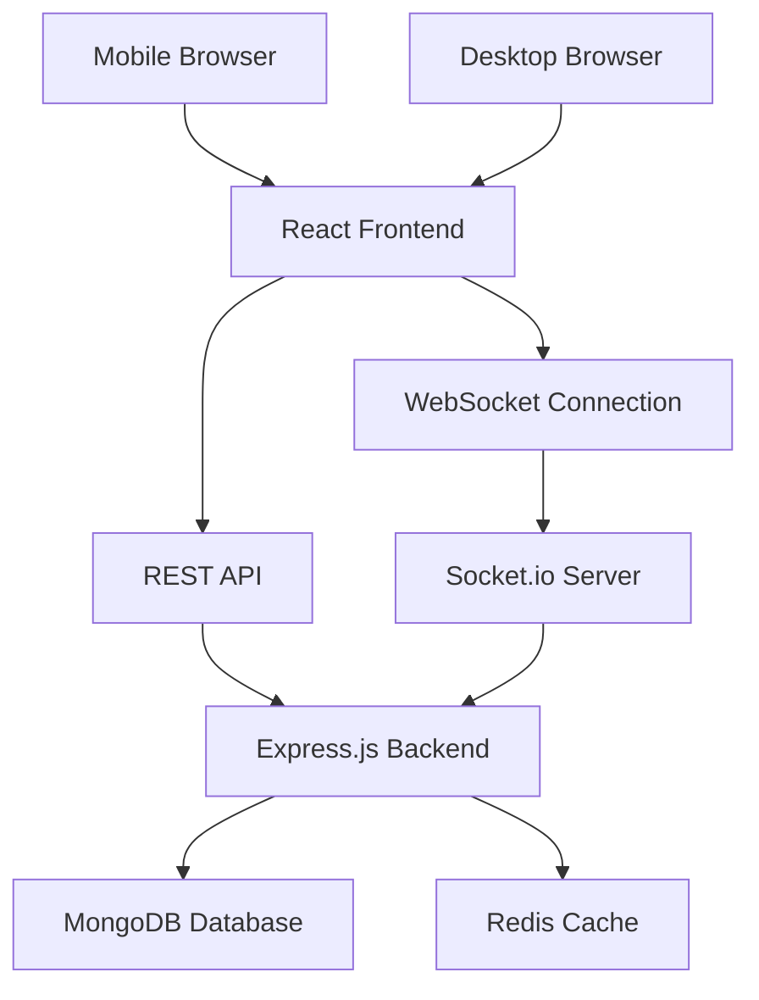

# Design Document

## Overview

hackerDen is a real-time collaborative web application designed to support hackathon teams through their entire event lifecycle. The system follows a phase-driven approach, providing specialized interfaces and workflows for kick-off, development sprint, and submission phases. The architecture prioritizes real-time collaboration, mobile responsiveness, and simplicity to ensure teams can focus on building rather than managing tools.

## Architecture

### System Architecture

The application follows a modern web architecture with real-time capabilities:



### Technology Stack

**Frontend:**
- React 18 with TypeScript for type safety and component reusability
- Tailwind CSS for responsive design and rapid styling
- React DnD for drag-and-drop task management
- Socket.io-client for real-time updates
- React Router for navigation between project phases

**Backend:**
- Node.js with Express.js for REST API endpoints
- Socket.io for real-time WebSocket communication
- MongoDB for document storage (projects, tasks, team data)
- Redis for session management and real-time state caching
- JWT for authentication and team access control

**Deployment:**
- Frontend: Vercel or Netlify for static hosting
- Backend: Railway or Heroku for API and WebSocket server
- Database: MongoDB Atlas for managed database hosting
- Cache: Redis Cloud for managed Redis instance

## Components and Interfaces

### Core Components

#### 1. Project Hub Component
```typescript
interface ProjectHub {
  projectId: string;
  projectName: string;
  oneLineIdea: string;
  teamMembers: TeamMember[];
  deadlines: {
    hackingEnds: Date;
    submissionDeadline: Date;
    presentationTime: Date;
  };
  judgingCriteria: JudgingCriterion[];
  pivotLog: PivotEntry[];
}

interface TeamMember {
  id: string;
  name: string;
  role?: string;
  joinedAt: Date;
}

interface JudgingCriterion {
  id: string;
  name: string;
  description?: string;
  completed: boolean;
}
```

#### 2. Task Board Component
```typescript
interface TaskBoard {
  projectId: string;
  columns: TaskColumn[];
  tasks: Task[];
}

interface TaskColumn {
  id: string;
  name: 'todo' | 'inprogress' | 'done';
  displayName: string;
  order: number;
}

interface Task {
  id: string;
  title: string;
  description?: string;
  assignedTo?: string;
  columnId: string;
  createdAt: Date;
  updatedAt: Date;
  order: number;
}
```

#### 3. Submission Package Component
```typescript
interface SubmissionPackage {
  projectId: string;
  githubUrl?: string;
  presentationUrl?: string;
  demoVideoUrl?: string;
  generatedPageUrl?: string;
  createdAt: Date;
  isComplete: boolean;
}
```

### API Endpoints

#### Project Management
- `POST /api/projects` - Create new project
- `GET /api/projects/:id` - Get project details
- `PUT /api/projects/:id` - Update project information
- `POST /api/projects/:id/members` - Add team member
- `DELETE /api/projects/:id/members/:memberId` - Remove team member

#### Task Management
- `GET /api/projects/:id/tasks` - Get all tasks for project
- `POST /api/projects/:id/tasks` - Create new task
- `PUT /api/tasks/:id` - Update task (including column changes)
- `DELETE /api/tasks/:id` - Delete task

#### Pivot Tracking
- `POST /api/projects/:id/pivots` - Log new pivot
- `GET /api/projects/:id/pivots` - Get pivot history

#### Submission Package
- `POST /api/projects/:id/submission` - Create/update submission package
- `GET /api/projects/:id/submission` - Get submission package
- `GET /api/submission/:id/public` - Public submission page

### WebSocket Events

#### Real-time Collaboration
- `project:updated` - Project information changed
- `task:created` - New task added
- `task:moved` - Task moved between columns
- `task:updated` - Task details changed
- `task:deleted` - Task removed
- `member:joined` - New team member added
- `pivot:logged` - New pivot entry added

## Data Models

### Database Schema

#### Projects Collection
```javascript
{
  _id: ObjectId,
  projectName: String,
  oneLineIdea: String,
  teamMembers: [{
    id: String,
    name: String,
    role: String,
    joinedAt: Date
  }],
  deadlines: {
    hackingEnds: Date,
    submissionDeadline: Date,
    presentationTime: Date
  },
  judgingCriteria: [{
    id: String,
    name: String,
    description: String,
    completed: Boolean
  }],
  pivotLog: [{
    id: String,
    description: String,
    reason: String,
    timestamp: Date
  }],
  createdAt: Date,
  updatedAt: Date
}
```

#### Tasks Collection
```javascript
{
  _id: ObjectId,
  projectId: ObjectId,
  title: String,
  description: String,
  assignedTo: String,
  columnId: String,
  order: Number,
  createdAt: Date,
  updatedAt: Date
}
```

#### Submissions Collection
```javascript
{
  _id: ObjectId,
  projectId: ObjectId,
  githubUrl: String,
  presentationUrl: String,
  demoVideoUrl: String,
  generatedPageUrl: String,
  isComplete: Boolean,
  createdAt: Date,
  updatedAt: Date
}
```

## Error Handling

### Client-Side Error Handling
- **Network Errors:** Implement retry logic with exponential backoff for API calls
- **WebSocket Disconnection:** Automatic reconnection with visual indicators for connection status
- **Validation Errors:** Real-time form validation with clear error messages
- **Offline Support:** Queue actions when offline and sync when connection is restored

### Server-Side Error Handling
- **Database Errors:** Graceful degradation with appropriate HTTP status codes
- **Validation Errors:** Comprehensive input validation with detailed error responses
- **Rate Limiting:** Implement rate limiting to prevent abuse
- **WebSocket Errors:** Proper error handling for socket connections and room management

### Error Response Format
```typescript
interface ErrorResponse {
  success: false;
  error: {
    code: string;
    message: string;
    details?: any;
  };
  timestamp: Date;
}
```

## Testing Strategy

### Unit Testing
- **Frontend:** Jest and React Testing Library for component testing
- **Backend:** Jest for API endpoint and business logic testing
- **Database:** MongoDB Memory Server for isolated database testing

### Integration Testing
- **API Testing:** Supertest for HTTP endpoint testing
- **WebSocket Testing:** Socket.io-client for real-time functionality testing
- **Database Integration:** Test database operations with real MongoDB instance

### End-to-End Testing
- **User Workflows:** Playwright for complete user journey testing
- **Cross-browser Testing:** Test on Chrome, Firefox, Safari, and mobile browsers
- **Real-time Collaboration:** Multi-user scenarios to test concurrent operations

### Performance Testing
- **Load Testing:** Test WebSocket connections with multiple concurrent users
- **Database Performance:** Test query performance with realistic data volumes
- **Mobile Performance:** Test responsiveness and performance on mobile devices

### Test Coverage Goals
- Unit Tests: 80% code coverage minimum
- Integration Tests: Cover all API endpoints and WebSocket events
- E2E Tests: Cover critical user paths for each hackathon phase

## Security Considerations

### Authentication & Authorization
- JWT-based authentication for team access
- Project-level access control (only team members can access project data)
- Rate limiting on API endpoints to prevent abuse

### Data Protection
- Input validation and sanitization for all user inputs
- HTTPS enforcement for all communications
- Secure WebSocket connections (WSS)
- Environment variable management for sensitive configuration

### Privacy
- No personal data collection beyond team member names
- Project data isolation between different teams
- Optional project deletion after hackathon completion