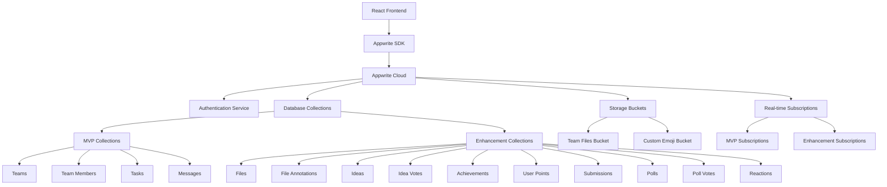

# Design Document

## Overview

HackerDen Enhancements builds upon the solid MVP foundation to create an engaging, gamified collaboration platform with advanced features. The enhancement suite integrates seamlessly with the existing React + Appwrite architecture while adding file sharing, idea management, gamification, judge submissions, polling, and delightful UX features.

The design maintains the MVP's core principles of real-time synchronization, mobile responsiveness, and rapid development while introducing new service layers, data models, and interactive components that enhance team collaboration and engagement.

## Architecture

### Enhanced System Architecture



### New Technology Integrations

- **File Storage**: Appwrite Storage for file uploads with preview generation
- **UI Components**: shadcn/ui components exclusively (Card, Dialog, Sheet, Badge, Progress, etc.)
- **Animations**: CSS animations and Tailwind transitions (no external animation libraries)
- **Sound Effects**: Web Audio API for optional sound feedback
- **Rich Text**: React Markdown for idea descriptions and file annotations
- **Image Processing**: Canvas API for image annotation overlays
- **Emoji Support**: Unicode emoji with custom emoji upload capabilities
- **Styling**: Existing Tailwind CSS classes and color scheme from MVP

### Enhanced Data Flow

1. **File Flow**: Upload → Storage → Database metadata → Real-time sync → Annotation system
2. **Gamification Flow**: Action triggers → Point calculation → Achievement check → Celebration effects → Leaderboard update
3. **Idea Flow**: Submission → Voting → Status updates → Task conversion → Chat notifications
4. **Submission Flow**: Data aggregation → Public page generation → Judge-friendly formatting
5. **Poll Flow**: Creation → Real-time voting → Results calculation → Action conversion

## Components and Interfaces

### File Sharing System

#### Core Components (shadcn/ui based)
- **FileLibrary**: Main file browser using `Card` and `ScrollArea` components
- **FileUpload**: Drag-and-drop using `Card` with `Progress` indicators and `Button` for upload
- **FilePreview**: `Dialog` component for viewing files with annotation support
- **AnnotationOverlay**: Interactive annotation using `Popover` and `Button` components
- **FileCard**: `Card` component with `Badge` for file type and `DropdownMenu` for actions

#### Service Interface
```javascript
interface FileService {
  uploadFile(teamId: string, file: File): Promise<FileDocument>
  getTeamFiles(teamId: string): Promise<FileDocument[]>
  addAnnotation(fileId: string, annotation: AnnotationData): Promise<Annotation>
  getFileAnnotations(fileId: string): Promise<Annotation[]>
  deleteFile(fileId: string): Promise<void>
  subscribeToFiles(teamId: string, callback: Function): Function
}
```

### Idea Management System

#### Core Components (shadcn/ui based)
- **IdeaBoard**: `ScrollArea` with `Card` grid layout and `Select` for sorting/filtering
- **IdeaCard**: `Card` component with `Badge` for status and `Button` for voting
- **IdeaModal**: `Dialog` with `Form`, `Input`, `Textarea`, and `Button` components
- **VotingInterface**: `Button` with vote count using existing MVP button styling
- **IdeaStatusBadge**: `Badge` component with variant colors matching MVP theme

#### Service Interface
```javascript
interface IdeaService {
  createIdea(teamId: string, ideaData: IdeaData): Promise<Idea>
  voteOnIdea(ideaId: string, userId: string): Promise<Vote>
  updateIdeaStatus(ideaId: string, status: IdeaStatus): Promise<Idea>
  getTeamIdeas(teamId: string): Promise<Idea[]>
  convertIdeaToTask(ideaId: string): Promise<Task>
  subscribeToIdeas(teamId: string, callback: Function): Function
}
```

### Gamification System

#### Core Components (shadcn/ui based)
- **AchievementNotification**: `Sonner` toast notifications for achievement celebrations
- **ConfettiEffect**: CSS animations using Tailwind classes (animate-bounce, animate-pulse)
- **Leaderboard**: `Card` with `Table` component for rankings and `Avatar` for users
- **ProgressBar**: `Progress` component with existing MVP color scheme
- **BadgeCollection**: `Card` grid with `Badge` components and `Tooltip` for descriptions

#### Service Interface
```javascript
interface GamificationService {
  awardPoints(userId: string, action: string, points: number): Promise<UserPoints>
  checkAchievements(userId: string): Promise<Achievement[]>
  getLeaderboard(teamId: string): Promise<LeaderboardData>
  triggerCelebration(type: string, data: any): Promise<void>
  getUserProgress(userId: string): Promise<UserProgress>
}
```

### Judge Submission System

#### Core Components (shadcn/ui based)
- **SubmissionBuilder**: `Form` with `Input`, `Textarea`, `Select` components in `Card` layout
- **SubmissionPreview**: `Sheet` or `Dialog` with live preview using same components as public page
- **PublicSubmissionPage**: Clean layout using `Card`, `Badge`, `Separator` with MVP color scheme
- **ProgressSummary**: `Card` with `Progress` bars and `Badge` components for status
- **TeamContributions**: `Card` with `Avatar`, `Badge`, and contribution metrics

#### Service Interface
```javascript
interface SubmissionService {
  createSubmission(teamId: string, submissionData: SubmissionData): Promise<Submission>
  updateSubmission(submissionId: string, updates: Partial<SubmissionData>): Promise<Submission>
  getPublicSubmission(submissionId: string): Promise<PublicSubmission>
  generateSubmissionUrl(submissionId: string): string
  finalizeSubmission(submissionId: string): Promise<Submission>
}
```

### Polling System

#### Core Components (shadcn/ui based)
- **PollCreator**: `Form` with `Input` for question and dynamic `Input` fields for options
- **PollDisplay**: `Card` component with `RadioGroup` or `Checkbox` for voting options
- **PollResults**: `Card` with `Progress` bars showing vote percentages and counts
- **PollHistory**: `ScrollArea` with `Card` components for past polls and `Collapsible` for details
- **QuickPoll**: Simplified `Card` with two `Button` components for yes/no voting

#### Service Interface
```javascript
interface PollService {
  createPoll(teamId: string, pollData: PollData): Promise<Poll>
  voteOnPoll(pollId: string, userId: string, option: string): Promise<PollVote>
  closePoll(pollId: string): Promise<Poll>
  getPollResults(pollId: string): Promise<PollResults>
  convertPollToTask(pollId: string, winningOption: string): Promise<Task>
}
```

### Bot and UX Enhancement System

#### Core Components (shadcn/ui based)
- **SystemBot**: Messages displayed in chat using existing message styling with `Badge` for bot identification
- **EasterEggTrigger**: Hidden commands that trigger `Sonner` toasts or special `Card` overlays
- **CustomTooltip**: Enhanced `Tooltip` component with personality and existing MVP styling
- **ReactionPicker**: `Popover` with emoji grid using `Button` components for selection
- **SoundManager**: Settings panel using `Card`, `Switch`, and `Slider` components

#### Service Interface
```javascript
interface BotService {
  sendMotivationalMessage(teamId: string, context: string): Promise<void>
  triggerEasterEgg(command: string, teamId: string): Promise<void>
  getContextualTips(userActivity: ActivityData): Promise<string[]>
  scheduleReminders(teamId: string, preferences: BotPreferences): Promise<void>
}
```

## Data Models

### Enhanced Appwrite Collections

#### Files Collection
```javascript
{
  $id: string,
  teamId: string,
  uploadedBy: string,
  fileName: string,
  fileType: string,
  fileSize: number,
  storageId: string, // Appwrite Storage file ID
  previewUrl: string,
  annotationCount: number,
  createdAt: string,
  updatedAt: string
}
```

#### File Annotations Collection
```javascript
{
  $id: string,
  fileId: string,
  userId: string,
  content: string,
  position: {
    x: number,
    y: number,
    width?: number,
    height?: number
  },
  type: 'point' | 'area' | 'line',
  createdAt: string
}
```

#### Ideas Collection
```javascript
{
  $id: string,
  teamId: string,
  createdBy: string,
  title: string,
  description: string,
  tags: string[],
  status: 'submitted' | 'approved' | 'in_progress' | 'completed' | 'rejected',
  voteCount: number,
  createdAt: string,
  updatedAt: string
}
```

#### Idea Votes Collection
```javascript
{
  $id: string,
  ideaId: string,
  userId: string,
  createdAt: string
}
```

#### User Points Collection
```javascript
{
  $id: string,
  userId: string,
  teamId: string,
  totalPoints: number,
  pointsBreakdown: {
    tasksCompleted: number,
    messagesPosted: number,
    filesUploaded: number,
    ideasSubmitted: number,
    votesGiven: number
  },
  updatedAt: string
}
```

#### Achievements Collection
```javascript
{
  $id: string,
  userId: string,
  achievementType: string,
  achievementName: string,
  description: string,
  iconUrl: string,
  pointsAwarded: number,
  unlockedAt: string
}
```

#### Submissions Collection
```javascript
{
  $id: string,
  teamId: string,
  title: string,
  description: string,
  techStack: string[],
  challenges: string,
  accomplishments: string,
  futureWork: string,
  demoUrl: string,
  repositoryUrl: string,
  isFinalized: boolean,
  publicUrl: string,
  createdAt: string,
  updatedAt: string
}
```

#### Polls Collection
```javascript
{
  $id: string,
  teamId: string,
  createdBy: string,
  question: string,
  options: string[],
  allowMultiple: boolean,
  expiresAt: string,
  isActive: boolean,
  totalVotes: number,
  createdAt: string
}
```

#### Poll Votes Collection
```javascript
{
  $id: string,
  pollId: string,
  userId: string,
  selectedOptions: string[],
  createdAt: string
}
```

#### Reactions Collection
```javascript
{
  $id: string,
  targetId: string, // messageId or taskId
  targetType: 'message' | 'task',
  userId: string,
  emoji: string,
  isCustom: boolean,
  createdAt: string
}
```

### Frontend Data Types

#### Enhanced Interfaces
```typescript
interface FileDocument {
  $id: string
  teamId: string
  uploadedBy: string
  fileName: string
  fileType: string
  fileSize: number
  storageId: string
  previewUrl: string
  annotationCount: number
  createdAt: string
  updatedAt: string
}

interface Idea {
  $id: string
  teamId: string
  createdBy: string
  title: string
  description: string
  tags: string[]
  status: IdeaStatus
  voteCount: number
  hasUserVoted?: boolean
  createdAt: string
  updatedAt: string
}

interface Achievement {
  $id: string
  userId: string
  achievementType: string
  achievementName: string
  description: string
  iconUrl: string
  pointsAwarded: number
  unlockedAt: string
}

interface Poll {
  $id: string
  teamId: string
  createdBy: string
  question: string
  options: PollOption[]
  allowMultiple: boolean
  expiresAt: string
  isActive: boolean
  totalVotes: number
  userVotes?: string[]
  createdAt: string
}

interface PollOption {
  text: string
  votes: number
  percentage: number
}
```

## Error Handling

### Enhanced Error Handling Strategies

#### File Upload Errors
- **File Size Limits**: Clear messaging for oversized files with compression suggestions
- **File Type Restrictions**: Whitelist validation with supported format guidance
- **Storage Quota**: Team storage limit monitoring with cleanup suggestions
- **Upload Failures**: Retry mechanism with progress preservation

#### Gamification Errors
- **Point Calculation Failures**: Graceful degradation without blocking core functionality
- **Achievement Unlock Errors**: Retry mechanism with offline achievement queuing
- **Animation Performance**: Reduced motion settings for low-performance devices
- **Sound Effect Failures**: Silent fallback with user notification options

#### Real-time Enhancement Errors
- **Subscription Overload**: Intelligent subscription management with priority queuing
- **Data Sync Conflicts**: Enhanced conflict resolution for complex data structures
- **Performance Degradation**: Automatic feature disabling under high load conditions

### Progressive Enhancement Strategy
- **Core Functionality First**: All enhancements degrade gracefully to MVP functionality
- **Feature Detection**: Runtime capability detection for advanced features
- **Offline Resilience**: Local storage caching for enhancement data
- **Performance Monitoring**: Automatic feature adjustment based on device capabilities

## Testing Strategy

### Enhanced Testing Approach

#### File System Testing
- **Upload Flow Testing**: Multi-format file upload with size and type validation
- **Annotation System Testing**: Interactive annotation placement and persistence
- **Storage Integration Testing**: Appwrite Storage API integration and error handling
- **Preview Generation Testing**: File preview rendering across different formats

#### Gamification Testing
- **Point Calculation Testing**: Accurate point awarding for various user actions
- **Achievement Logic Testing**: Complex achievement unlock conditions and timing
- **Animation Performance Testing**: Smooth animations across different devices
- **Leaderboard Accuracy Testing**: Real-time leaderboard updates and sorting

#### Real-time Enhancement Testing
- **Multi-feature Sync Testing**: Simultaneous real-time updates across enhancement features
- **Performance Impact Testing**: Enhancement feature impact on MVP performance
- **Subscription Management Testing**: Efficient real-time subscription handling
- **Cross-feature Integration Testing**: Seamless integration between enhancement features

#### Mobile Enhancement Testing
- **Touch Interaction Testing**: Enhanced touch interactions for new features
- **Performance Testing**: Mobile performance with all enhancement features enabled
- **Responsive Design Testing**: New components across all device sizes
- **Accessibility Testing**: Enhanced accessibility features and compliance

### Integration Testing Strategy
- **MVP Compatibility Testing**: Ensure enhancements don't break existing MVP functionality
- **Data Migration Testing**: Safe addition of new collections and data structures
- **Feature Flag Testing**: Gradual rollout capability for enhancement features
- **Backward Compatibility Testing**: Graceful handling of missing enhancement data

## Development Workflow Integration

### Enhanced Styling Preservation

#### shadcn/ui Component Guidelines
- **Component Consistency**: Use only shadcn/ui components with existing MVP Tailwind classes
- **Color Scheme Preservation**: Maintain existing dark theme colors and CSS custom properties
- **Interactive State Preservation**: Preserve hover, focus, and active states using shadcn/ui variants
- **Responsive Enhancement Preservation**: Use Tailwind responsive classes consistent with MVP
- **Theme Integration**: All new shadcn/ui components follow existing CSS variable system

#### Enhanced Merge Workflow
```javascript
// Additional elements to preserve during merges
- shadcn/ui component props and className attributes
- Existing Tailwind color classes and CSS custom properties
- File upload drag-and-drop styling using shadcn/ui Card variants
- Gamification celebration effects using CSS animations and Tailwind classes
- Poll and voting interface states using shadcn/ui component variants
- Custom emoji picker styling using shadcn/ui Popover and Button components
- Mobile-optimized touch targets using shadcn/ui responsive patterns
```

#### Component Integration Patterns
- **shadcn/ui First**: All new components built exclusively with shadcn/ui primitives
- **MVP Styling Inheritance**: Enhancement components use existing Tailwind classes and CSS variables
- **Performance-Conscious Components**: Use shadcn/ui lazy loading patterns and Suspense boundaries
- **Accessibility-First Enhancement**: shadcn/ui components maintain WCAG compliance by default

### Feature Flag Architecture
```javascript
interface FeatureFlags {
  fileSharing: boolean
  ideaBoard: boolean
  gamification: boolean
  judgeSubmissions: boolean
  polling: boolean
  botEnhancements: boolean
  customEmoji: boolean
  easterEggs: boolean
}
```

This design ensures that all enhancement features integrate seamlessly with the existing MVP while providing rich, engaging experiences that make hackathon collaboration more fun and productive.