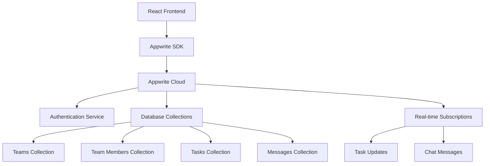

# Design Document

## Overview

HackerDen MVP is a React-based team collaboration platform built on Appwrite's Backend-as-a-Service infrastructure. The system provides three core integrated features: team management through join codes, visual task management via Kanban boards, and real-time team chat. The architecture prioritizes rapid development, real-time synchronization, and mobile responsiveness to deliver a streamlined hackathon team experience.

The application follows a single-page application (SPA) pattern with client-side routing, leveraging Appwrite's real-time subscriptions for live updates and built-in authentication for user management.

## Architecture

### High-Level Architecture



### Technology Stack

- **Frontend**: React 18 with Vite for fast development and building
- **Styling**: Tailwind CSS for responsive design and rapid UI development
- **Backend**: Appwrite Cloud for authentication, database, and real-time features
- **State Management**: React Context API with custom hooks for team and auth state
- **Routing**: React Router for client-side navigation
- **Real-time**: Appwrite's WebSocket-based real-time subscriptions

### Data Flow

1. **Authentication Flow**: Users register/login through Appwrite Auth → Context updates → Route protection
2. **Team Flow**: Team creation/joining → Database updates → Context updates → Dashboard access
3. **Task Flow**: Task CRUD operations → Database updates → Real-time sync → UI updates → Chat notifications
4. **Chat Flow**: Message creation → Database updates → Real-time sync → UI updates

## Components and Interfaces

### Core Components

#### Authentication Layer
- **LoginPage**: Form-based login with validation and error handling
- **RegisterPage**: User registration with team status checking
- **ProtectedRoute**: Route wrapper that enforces authentication
- **useAuth**: Custom hook managing authentication state and methods

#### Team Management
- **TeamSelector**: Displays create/join options for users without teams
- **TeamCreationPage**: Team creation form with join code generation
- **TeamJoinPage**: Join code input with validation and error handling
- **useTeam**: Custom hook managing team membership and data

#### Dashboard Layout
- **Dashboard**: Main container with responsive layout switching
- **Layout**: Common header, navigation, and content structure
- **MobileTabSwitcher**: Mobile navigation between Kanban and Chat views

#### Kanban System
- **KanbanBoard**: Four-column board container with drag-and-drop zones
- **TaskColumn**: Individual column component (To-Do, In Progress, Blocked, Done)
- **TaskCard**: Individual task display with drag handlers
- **TaskModal**: Task creation/editing form with validation
- **useTasks**: Custom hook managing task state and operations

#### Chat System
- **Chat**: Message list and input container
- **MessageList**: Scrollable message history with auto-scroll
- **MessageInput**: Text input with send functionality and validation
- **MessageItem**: Individual message display with user/system styling
- **useMessages**: Custom hook managing message state and operations

### Service Interfaces

#### Authentication Service
```javascript
interface AuthService {
  login(email: string, password: string): Promise<User>
  register(email: string, password: string, name: string): Promise<User>
  logout(): Promise<void>
  getCurrentUser(): Promise<User | null>
}
```

#### Team Service
```javascript
interface TeamService {
  createTeam(name: string): Promise<{team: Team, joinCode: string}>
  joinTeam(joinCode: string): Promise<Team>
  getUserTeam(userId: string): Promise<Team | null>
  generateJoinCode(): string
}
```

#### Task Service
```javascript
interface TaskService {
  createTask(teamId: string, task: TaskData): Promise<Task>
  updateTaskStatus(taskId: string, status: TaskStatus): Promise<Task>
  getTeamTasks(teamId: string): Promise<Task[]>
  subscribeToTasks(teamId: string, callback: Function): Function
}
```

#### Message Service
```javascript
interface MessageService {
  sendMessage(teamId: string, content: string): Promise<Message>
  sendSystemMessage(teamId: string, content: string, type: string): Promise<Message>
  getTeamMessages(teamId: string): Promise<Message[]>
  subscribeToMessages(teamId: string, callback: Function): Function
}
```

## Data Models

### Appwrite Collections Schema

#### Teams Collection
```javascript
{
  $id: string,
  name: string,
  joinCode: string, // 6-character unique code
  ownerId: string,
  createdAt: string,
  updatedAt: string
}
```

#### Team Members Collection
```javascript
{
  $id: string,
  teamId: string,
  userId: string,
  role: 'owner' | 'member',
  joinedAt: string
}
```

#### Tasks Collection
```javascript
{
  $id: string,
  teamId: string,
  title: string,
  description: string,
  status: 'todo' | 'in_progress' | 'blocked' | 'done',
  assignedTo: string, // userId
  createdBy: string, // userId
  createdAt: string,
  updatedAt: string
}
```

#### Messages Collection
```javascript
{
  $id: string,
  teamId: string,
  userId: string, // null for system messages
  content: string,
  type: 'user' | 'system',
  createdAt: string
}
```

### Frontend Data Types

#### User Interface
```typescript
interface User {
  $id: string
  name: string
  email: string
}
```

#### Team Interface
```typescript
interface Team {
  $id: string
  name: string
  joinCode: string
  ownerId: string
  members?: TeamMember[]
}
```

#### Task Interface
```typescript
interface Task {
  $id: string
  teamId: string
  title: string
  description: string
  status: 'todo' | 'in_progress' | 'blocked' | 'done'
  assignedTo: string
  createdBy: string
  createdAt: string
  updatedAt: string
}
```

## Error Handling

### Client-Side Error Handling

#### Authentication Errors
- Invalid credentials → Display user-friendly error message
- Network errors → Show retry option with offline indicator
- Session expiry → Automatic redirect to login with context preservation

#### Team Management Errors
- Invalid join code → Clear error message with retry option
- Duplicate team membership → Redirect to existing team dashboard
- Team creation failures → Form validation with specific error messages

#### Real-time Connection Errors
- WebSocket disconnection → Automatic reconnection with exponential backoff
- Subscription failures → Fallback to polling with user notification
- Sync conflicts → Appwrite's built-in conflict resolution with user notification

#### Task Management Errors
- Validation errors → Inline form validation with field-specific messages
- Drag-and-drop failures → Revert to original position with error notification
- Concurrent modifications → Real-time sync with optimistic updates and rollback

### Error Boundaries
- Global error boundary for unhandled React errors
- Component-level error boundaries for isolated failure recovery
- Service-level error handling with consistent error response format

## Testing Strategy

### Unit Testing
- **Components**: React Testing Library for component behavior and user interactions
- **Services**: Jest for service function logic and Appwrite integration mocking
- **Hooks**: React Hooks Testing Library for custom hook behavior
- **Utilities**: Jest for helper functions and data transformations

### Integration Testing
- **Authentication Flow**: End-to-end user registration, login, and route protection
- **Team Management**: Complete team creation and joining workflows
- **Real-time Features**: Multi-client synchronization testing with WebSocket mocking
- **Mobile Responsiveness**: Cross-device testing with viewport simulation

### End-to-End Testing
- **Core User Journeys**: Complete workflows from registration to task completion
- **Real-time Synchronization**: Multi-browser testing for live updates
- **Mobile Experience**: Touch interaction testing on actual devices
- **Error Recovery**: Network interruption and reconnection scenarios

### Performance Testing
- **Real-time Updates**: Latency measurement for task and message synchronization
- **Mobile Performance**: Touch responsiveness and rendering performance
- **Load Testing**: Multiple concurrent users and real-time subscriptions
- **Bundle Size**: Code splitting and lazy loading optimization verification

### Accessibility Testing
- **Screen Reader Compatibility**: ARIA labels and semantic HTML validation
- **Keyboard Navigation**: Tab order and focus management testing
- **Color Contrast**: WCAG compliance for visual accessibility
- **Touch Targets**: Mobile accessibility guidelines compliance