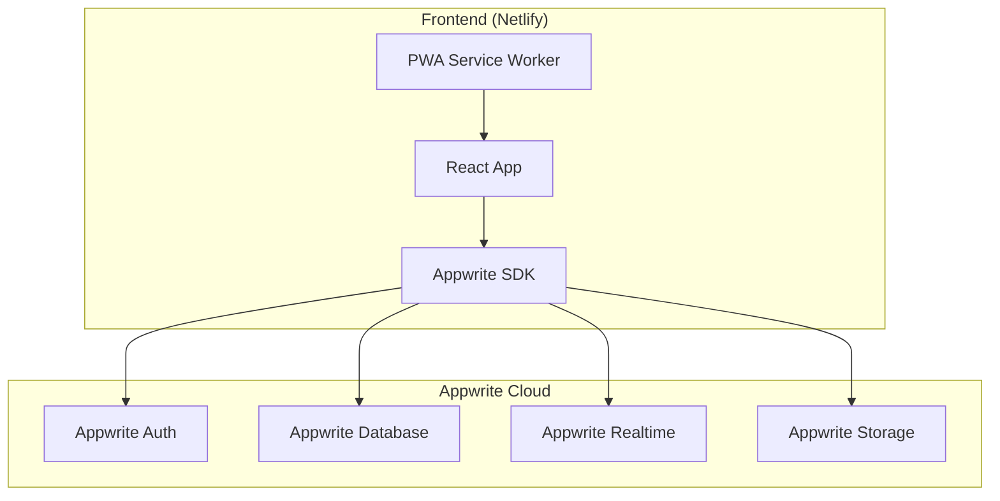

# Design Document

## Overview

HackerDen V01 is a real-time collaboration platform built specifically for hackathon teams. The system architecture prioritizes instant synchronization, mobile-first responsive design, and zero-friction user experience. The platform uses a modern web stack with WebSocket-based real-time communication, component-based frontend architecture, and a scalable backend designed to handle multiple concurrent hackathon teams.

## Architecture

### High-Level Architecture



### Technology Stack

**Frontend:**
- React 18 with JavaScript (keeping it simple, no TypeScript)
- Tailwind CSS for mobile-first responsive design
- Appwrite SDK for real-time communication and data management
- React Query for server state management
- HTML5 drag-and-drop API for task management
- PWA capabilities for mobile app-like experience

**Backend:**
- Appwrite Cloud (Backend-as-a-Service)
- Appwrite Database for data storage
- Appwrite Realtime for WebSocket functionality
- Appwrite Auth for user authentication
- Appwrite Storage for file management

**Infrastructure:**
- Netlify for frontend hosting and deployment
- Appwrite Cloud for backend services
- Netlify CDN for static asset delivery
- No custom server infrastructure needed

## Components and Interfaces

### Frontend Components

#### 1. Dashboard Component
```javascript
// Simple React component with props
function Dashboard({ user, team, activities, notifications }) {
  const [activePanel, setActivePanel] = useState('chat');
  const [helpAlerts, setHelpAlerts] = useState([]);
  const [onlineMembers, setOnlineMembers] = useState([]);
  
  return (
    // Dashboard JSX
  );
}
```

#### 2. Real-time Chat Component
```javascript
function Chat({ teamId, messages, onSendMessage, onTagMessage }) {
  const [newMessage, setNewMessage] = useState('');
  
  // Message structure:
  // {
  //   $id: string,
  //   content: string,
  //   authorId: string,
  //   timestamp: Date,
  //   type: 'text' | 'markdown' | 'code',
  //   tags: string[],
  //   threadId?: string
  // }
  
  return (
    // Chat JSX
  );
}
```

#### 3. Kanban Board Component
```javascript
function KanbanBoard({ tasks, onTaskMove, onTaskUpdate }) {
  const columns = ['todo', 'in-progress', 'blocked', 'done'];
  
  // Task structure:
  // {
  //   $id: string,
  //   title: string,
  //   description: string,
  //   assignees: string[], // user IDs
  //   priority: 'low' | 'medium' | 'high' | 'urgent',
  //   status: 'todo' | 'in-progress' | 'blocked' | 'done',
  //   checklist: object[],
  //   comments: object[],
  //   attachments: object[]
  // }
  
  return (
    // Kanban JSX
  );
}
```

#### 4. Activity Feed Component
```javascript
function ActivityFeed({ activities, filters, onFilterChange }) {
  // Activity structure:
  // {
  //   $id: string,
  //   type: 'task_update' | 'chat_message' | 'file_upload' | 'wiki_edit',
  //   actorId: string,
  //   timestamp: Date,
  //   metadata: object,
  //   teamId: string
  // }
  
  return (
    // Activity feed JSX
  );
}
```

### Appwrite Integration

#### 1. Appwrite SDK Usage
```javascript
import { Client, Account, Databases, Realtime, Storage } from 'appwrite';

// Initialize Appwrite client
const client = new Client()
  .setEndpoint('https://cloud.appwrite.io/v1')
  .setProject('[PROJECT_ID]');

const account = new Account(client);
const databases = new Databases(client);
const realtime = new Realtime(client);
const storage = new Storage(client);
```

#### 2. Real-time Subscriptions
```javascript
// Subscribe to team messages
realtime.subscribe(`databases.[DATABASE_ID].collections.messages.documents`, response => {
  if (response.events.includes('databases.*.collections.*.documents.*.create')) {
    // Handle new message
  }
});

// Subscribe to task updates
realtime.subscribe(`databases.[DATABASE_ID].collections.tasks.documents`, response => {
  if (response.events.includes('databases.*.collections.*.documents.*.update')) {
    // Handle task update
  }
});
```

#### 3. Database Operations
```javascript
// Create team
await databases.createDocument('[DATABASE_ID]', 'teams', ID.unique(), {
  name: 'Team Name',
  description: 'Team Description',
  hackathon_name: 'Hackathon 2025'
});

// Create task
await databases.createDocument('[DATABASE_ID]', 'tasks', ID.unique(), {
  team_id: teamId,
  title: 'Task Title',
  description: 'Task Description',
  status: 'todo',
  priority: 'medium'
});

// Send message
await databases.createDocument('[DATABASE_ID]', 'messages', ID.unique(), {
  team_id: teamId,
  author_id: userId,
  content: 'Message content',
  message_type: 'text'
});
```

## Data Models

### Appwrite Collections

#### Users Collection (Built-in Appwrite Auth)
```javascript
// Appwrite handles user authentication automatically
// Additional user data stored in 'user_profiles' collection:
{
  $id: "unique_id",
  user_id: "appwrite_user_id", // Links to Appwrite auth user
  username: "string",
  full_name: "string", 
  avatar_url: "string",
  $createdAt: "datetime",
  $updatedAt: "datetime"
}
```

#### Teams Collection
```javascript
{
  $id: "unique_id",
  name: "string", // required
  description: "string",
  hackathon_name: "string",
  demo_date: "datetime",
  created_by: "string", // user_id
  $createdAt: "datetime",
  $updatedAt: "datetime"
}
```

#### Team Members Collection
```javascript
{
  $id: "unique_id",
  team_id: "string", // relationship to teams
  user_id: "string", // relationship to users
  role: "string", // default: "member"
  joined_at: "datetime",
  $createdAt: "datetime",
  $updatedAt: "datetime"
}
```

#### Tasks Collection
```javascript
{
  $id: "unique_id",
  team_id: "string", // relationship to teams
  title: "string", // required
  description: "string",
  status: "string", // default: "todo"
  priority: "string", // default: "medium"
  assignees: "string[]", // array of user_ids
  checklist: "object[]",
  comments: "object[]",
  attachments: "object[]",
  created_by: "string", // user_id
  $createdAt: "datetime",
  $updatedAt: "datetime"
}
```

#### Messages Collection
```javascript
{
  $id: "unique_id",
  team_id: "string", // relationship to teams
  author_id: "string", // user_id
  content: "string", // required
  message_type: "string", // default: "text"
  thread_id: "string", // optional, for threaded replies
  tags: "string[]", // array of tags like ["important", "blocked"]
  $createdAt: "datetime",
  $updatedAt: "datetime"
}
```

#### Activities Collection
```javascript
{
  $id: "unique_id",
  team_id: "string", // relationship to teams
  type: "string", // "task_update", "chat_message", "file_upload", etc.
  actor_id: "string", // user_id who performed the action
  metadata: "object", // additional data about the activity
  $createdAt: "datetime",
  $updatedAt: "datetime"
}
```

#### Files Collection
```javascript
{
  $id: "unique_id",
  team_id: "string", // relationship to teams
  name: "string",
  url: "string", // external link or Appwrite storage URL
  type: "string", // "link", "upload", "google_drive", etc.
  uploaded_by: "string", // user_id
  $createdAt: "datetime",
  $updatedAt: "datetime"
}
```

## Error Handling

### Client-Side Error Handling
- **Network Errors**: Automatic retry with exponential backoff
- **WebSocket Disconnection**: Automatic reconnection with state recovery
- **Validation Errors**: Real-time form validation with user-friendly messages
- **Offline Mode**: Service worker caches critical data for offline access

### Server-Side Error Handling
- **Database Errors**: Transaction rollback and error logging
- **WebSocket Errors**: Graceful connection cleanup and client notification
- **Authentication Errors**: Clear error messages and redirect to login
- **Rate Limiting**: Prevent abuse with per-user and per-team limits

### Error Response Format
```typescript
interface ErrorResponse {
  error: {
    code: string;
    message: string;
    details?: Record<string, any>;
    timestamp: string;
  };
}
```

## Testing Strategy

### Frontend Testing
- **Unit Tests**: Jest + React Testing Library for component logic
- **Integration Tests**: Simple manual testing for user workflows
- **Mobile Testing**: Browser dev tools and real device testing
- **Appwrite Integration**: Test with Appwrite's built-in testing tools

### Manual Testing Scenarios
- **Team Creation**: Create team, invite members, set up basic info
- **Real-time Chat**: Send messages, verify real-time updates across browsers
- **Task Management**: Create, update, move tasks between columns
- **Help Alerts**: Test help request system
- **Mobile Experience**: Test all features on mobile browsers
- **File Sharing**: Test link sharing and basic file management

### Simple Testing Setup
```javascript
// Basic component tests with React Testing Library
import { render, screen } from '@testing-library/react';
import Dashboard from './Dashboard';

test('renders dashboard with navigation', () => {
  render(<Dashboard user={mockUser} team={mockTeam} />);
  expect(screen.getByText('Chat')).toBeInTheDocument();
  expect(screen.getByText('Tasks')).toBeInTheDocument();
});
```

## Performance Considerations

### Appwrite Optimization
- **Real-time Subscriptions**: Subscribe only to necessary collections and documents
- **Query Optimization**: Use Appwrite's built-in indexing and filtering
- **Pagination**: Implement pagination for large datasets (messages, activities)
- **Selective Loading**: Load only current team data, not all user teams

### Frontend Performance
- **Component Optimization**: Use React.memo for expensive components
- **State Management**: Keep state simple with useState and useContext
- **Bundle Size**: Keep dependencies minimal, target <500KB total bundle
- **Lazy Loading**: Load non-critical components on demand

### Mobile Performance
- **Touch Interactions**: Use CSS transforms for smooth animations
- **Image Optimization**: Compress avatars and use appropriate sizes
- **Network Efficiency**: Minimize API calls, batch operations when possible
- **Offline Handling**: Basic offline detection and user feedback

## Security Considerations

### Appwrite Security (Built-in)
- **Authentication**: Appwrite handles secure user authentication
- **Authorization**: Use Appwrite's permission system for team-based access
- **Data Validation**: Appwrite provides built-in input validation
- **HTTPS**: All Appwrite communications are encrypted

### Application Security
- **Team Isolation**: Ensure users can only access their team data
- **Input Sanitization**: Sanitize user inputs before displaying (especially chat messages)
- **XSS Protection**: Use React's built-in XSS protection, avoid dangerouslySetInnerHTML
- **Environment Variables**: Store Appwrite project ID and keys securely

### Privacy & Permissions
- **Team-based Access**: Users can only see teams they're members of
- **Role-based Features**: Basic member vs admin roles within teams
- **Data Minimization**: Collect only essential user information
- **Appwrite Compliance**: Leverage Appwrite's built-in GDPR compliance features