# HackerDen UX Flowchart

## Complete User Experience Flow

This document provides a detailed flowchart of the HackerDen user experience, covering all user journeys from initial registration through advanced enhancement features.

## 🎯 User Entry Points

```
┌─────────────────────────────────────────────────────────────────┐
│                        ENTRY POINTS                             │
├─────────────────────────────────────────────────────────────────┤
│ 1. Direct URL Access → Landing Page                             │
│ 2. Hackathon Organizer Invitation → Registration               │
│ 3. Team Member Invitation → Join Team Flow                     │
│ 4. Judge Access → Public Submission Page                       │
└─────────────────────────────────────────────────────────────────┘
```

## 🔐 Authentication Flow (OAuth Only)

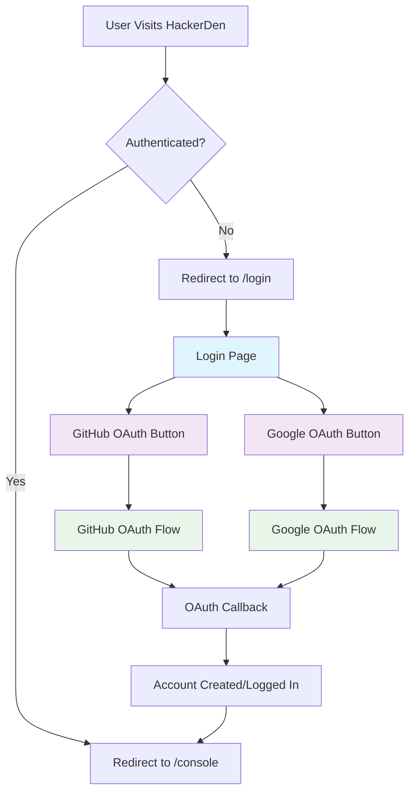

## 🏠 Main Console Flow

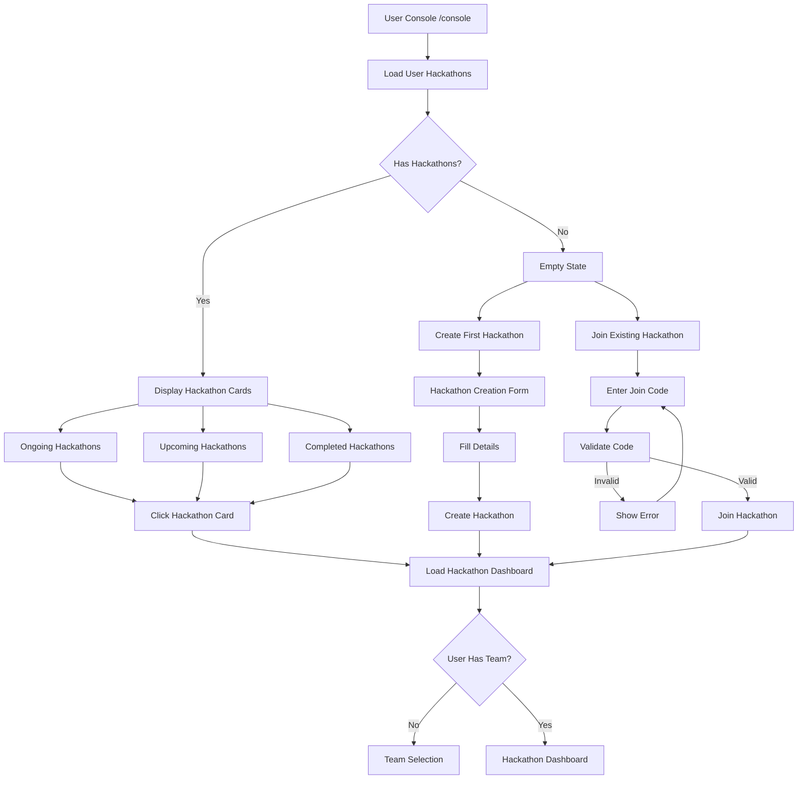

## 👥 Team Management Flow

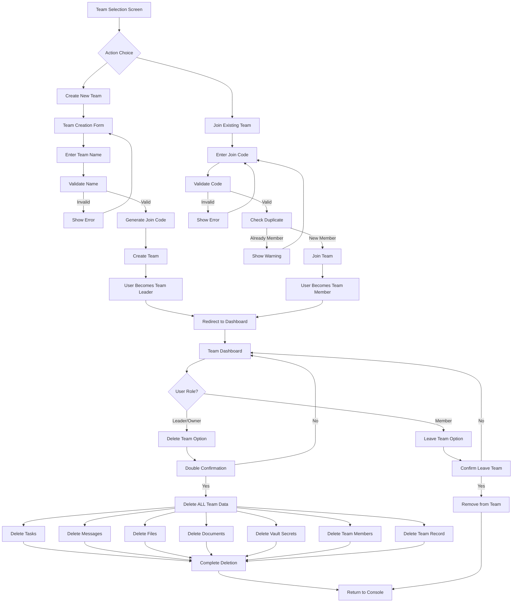

## 📋 Task Management Flow

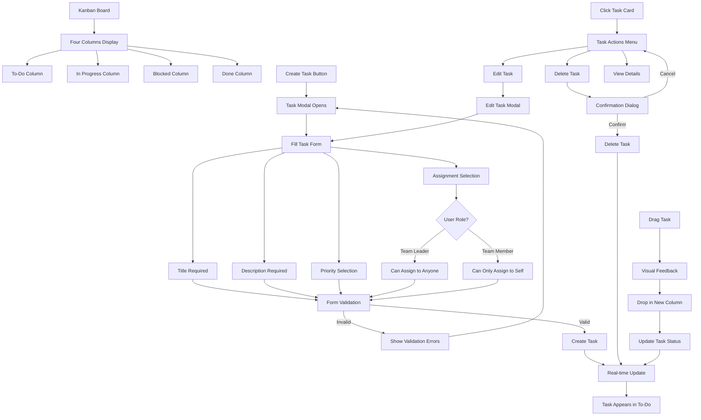

## 💬 Chat System Flow

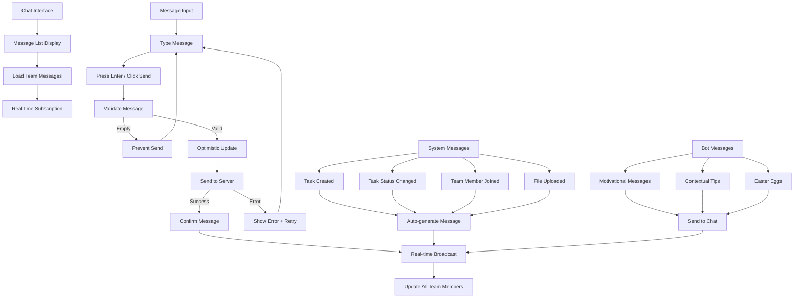

## 📁 File Sharing Flow

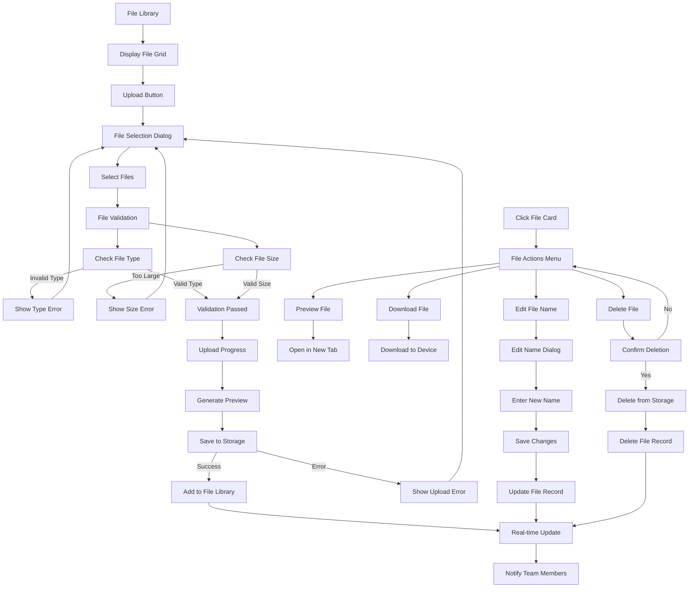

## 💡 Idea Management Flow

**REMOVED FOR FINAL SUBMISSION** - This feature has been simplified out of the application to focus on core hackathon functionality.

## 🎮 Gamification Flow

**REMOVED FOR FINAL SUBMISSION** - This feature has been simplified out of the application to focus on core hackathon functionality.

## 📊 Polling System Flow

**REMOVED FOR FINAL SUBMISSION** - This feature has been simplified out of the application to focus on core hackathon functionality.

## 🏆 Judge Submission Flow

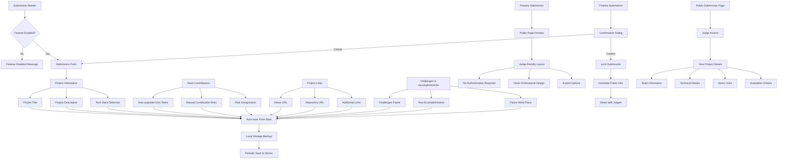

## 🧭 Navigation Flow (Simplified)

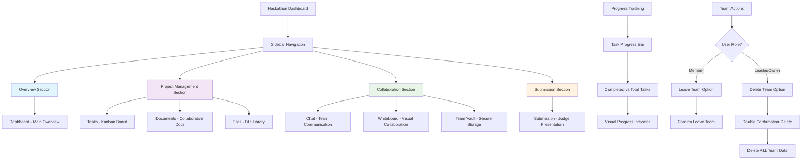

## 🤖 Bot System & Easter Eggs Flow

```mermaid
graph TD
    A[Bot System] --> B{Feature Enabled?}
    B -->|No| C[Feature Disabled Message]
    B -->|Yes| D[Monitor Team Activity]
    
    D --> E[Activity Pattern Analysis]
    E --> F[Long Inactivity Detected]
    E --> G[High Activity Detected]
    E --> H[Milestone Reached]
    E --> I[Special Date/Time]
    
    F --> J[Motivational Message]
    G --> K[Productivity Tip]
    H --> L[Celebration Message]
    I --> M[Themed Decoration]
    
    J --> N[Send Bot Message]
    K --> N
    L --> N
    M --> N
    
    N --> O[Chat Integration]
    O --> P[Real-time Delivery]
    
    Q[Easter Egg Commands] --> R[/party Command]
    Q --> S[/celebrate Command]
    Q --> T[/motivate Command]
    Q --> U[Hidden Commands]
    
    R --> V[Team-wide Confetti]
    S --> W[Achievement Animation]
    T --> X[Random Motivation]
    U --> Y[Special Effects]
    
    V --> Z[Broadcast to All Members]
    W --> Z
    X --> Z
    Y --> Z
    
    AA[Bot Settings] --> BB[Personality Selection]
    AA --> CC[Message Frequency]
    AA --> DD[Effect Preferences]
    
    BB --> EE[Friendly/Professional/Casual]
    CC --> FF[High/Medium/Low/Off]
    DD --> GG[Enable/Disable Animations]
    DD --> HH[Enable/Disable Sounds]
    
    EE --> II[Update Bot Behavior]
    FF --> II
    GG --> II
    HH --> II
```

## 📱 Mobile Experience Flow

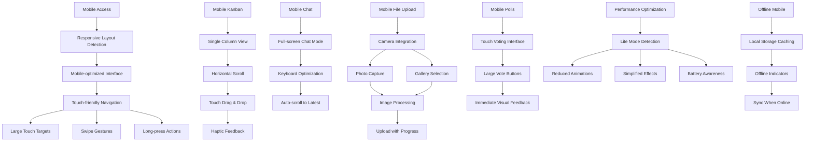

## 🔄 Error Handling & Recovery Flow

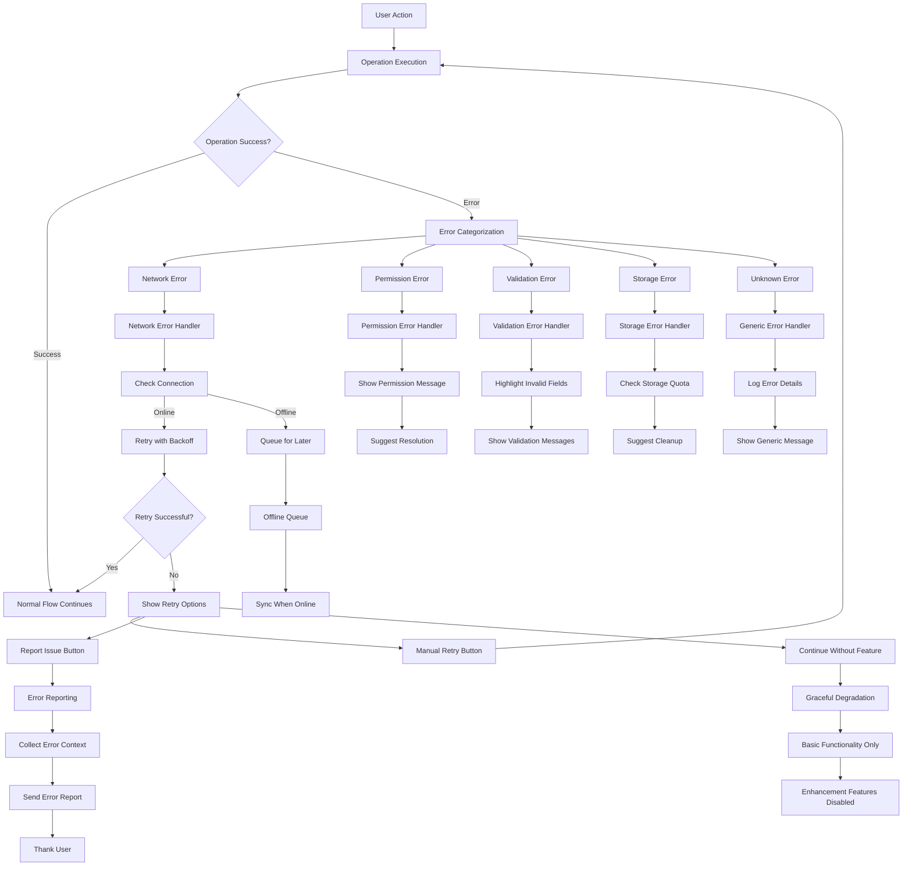

## 🎛️ Feature Flag Flow

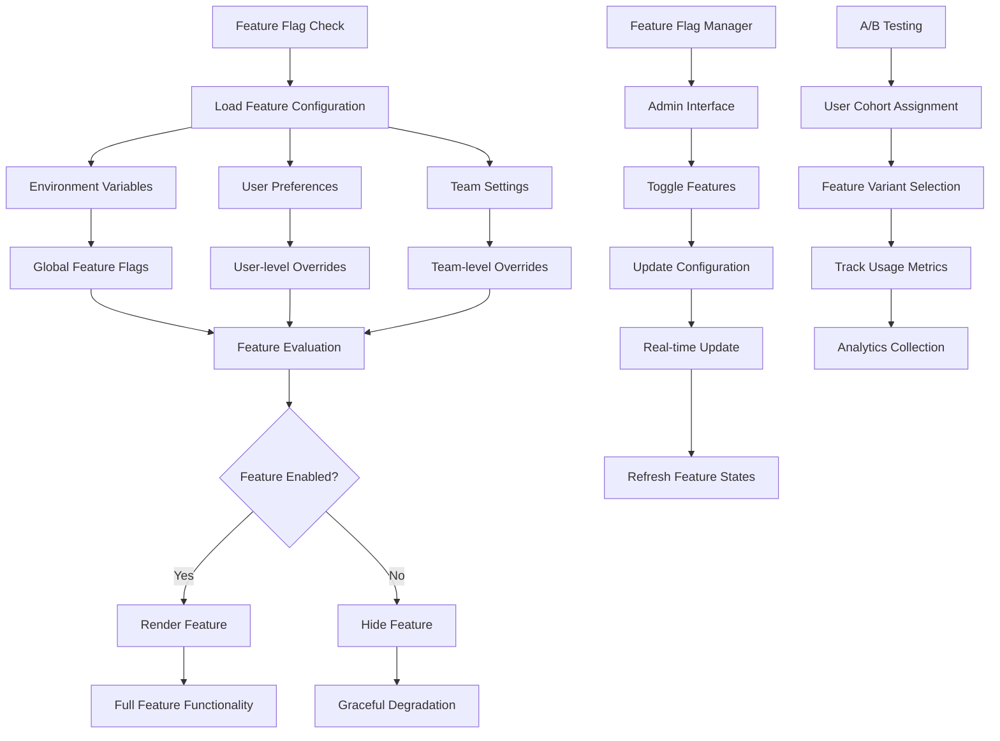

## 🔍 Search & Discovery Flow

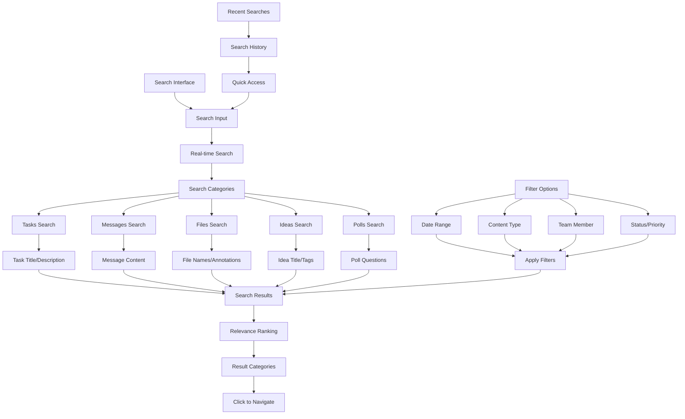

## 📈 Analytics & Insights Flow

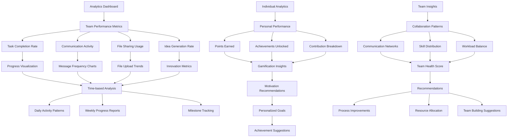

## 🎨 Theming & Customization Flow

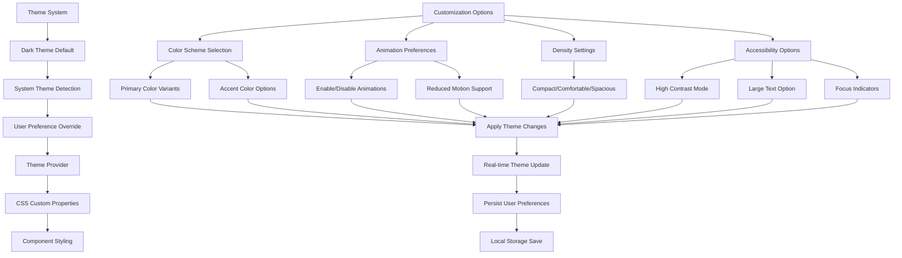

## 🔐 Security & Privacy Flow

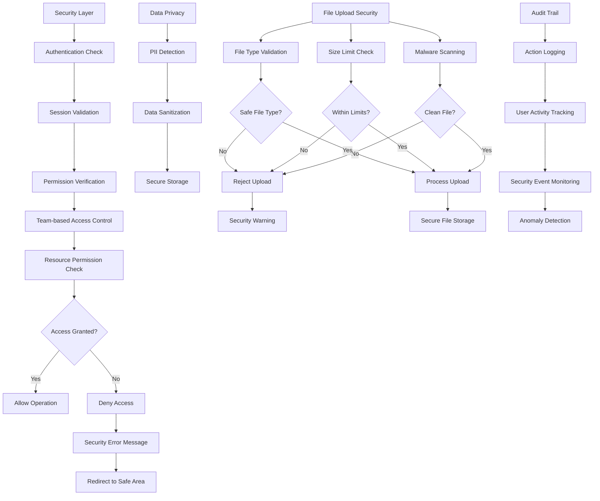

## 🌐 Real-time Synchronization Flow

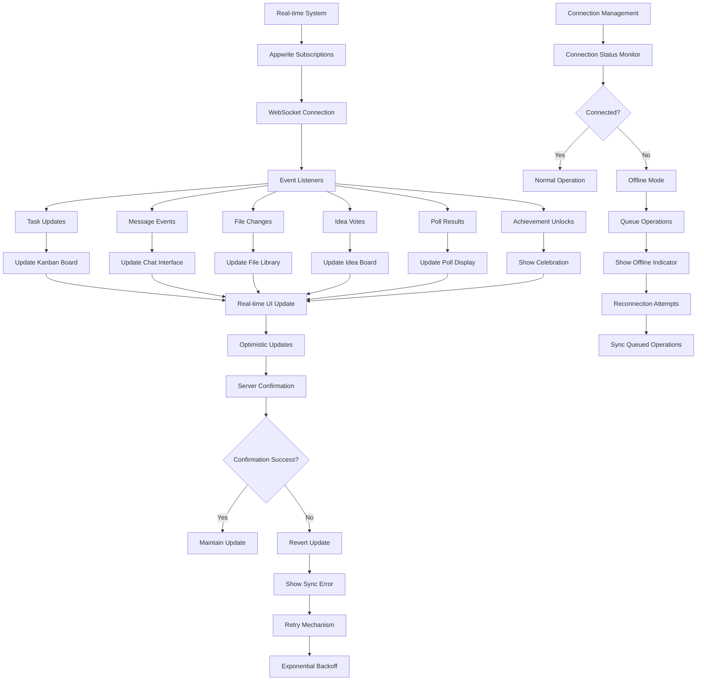

---

## 📋 User Journey Summary (Simplified)

### New User Journey (First Time)
1. **Discovery** → OAuth Registration (GitHub/Google)
2. **Onboarding** → Console Tour → Create/Join Hackathon
3. **Team Setup** → Create/Join Team → Role Assignment
4. **Core Features** → Task Creation → Chat Usage → File Sharing
5. **Collaboration** → Team Communication → Progress Tracking

### Returning User Journey
1. **OAuth Login** → Console → Select Active Hackathon
2. **Dashboard** → Check Progress → Review Team Status
3. **Collaboration** → Tasks → Chat → Files → Documents
4. **Productivity** → Complete Tasks → Track Progress
5. **Submission** → Build Submission → Finalize for Judges

### Team Leader Journey
1. **Team Management** → Create Team → Share Join Code
2. **Task Coordination** → Assign Tasks → Monitor Progress
3. **Resource Management** → File Organization → Document Management
4. **Team Actions** → Leave Team (Members) → Delete Team (Leaders)
5. **Data Management** → Comprehensive Team Data Cleanup
6. **Submission Oversight** → Review Submission → Final Approval

### Judge Journey
1. **Direct Access** → Public Submission URL → No Authentication
2. **Evaluation** → Review Project Details → Check Demo Links
3. **Assessment** → Technical Evaluation → Team Contributions
4. **Decision** → Scoring → Feedback → Final Judgment

This comprehensive UX flowchart covers all major user interactions and system flows in HackerDen, providing a detailed map of the user experience from entry to completion of hackathon activities.